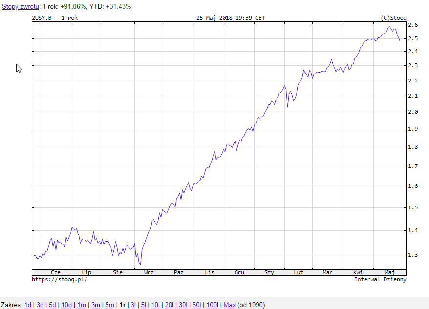
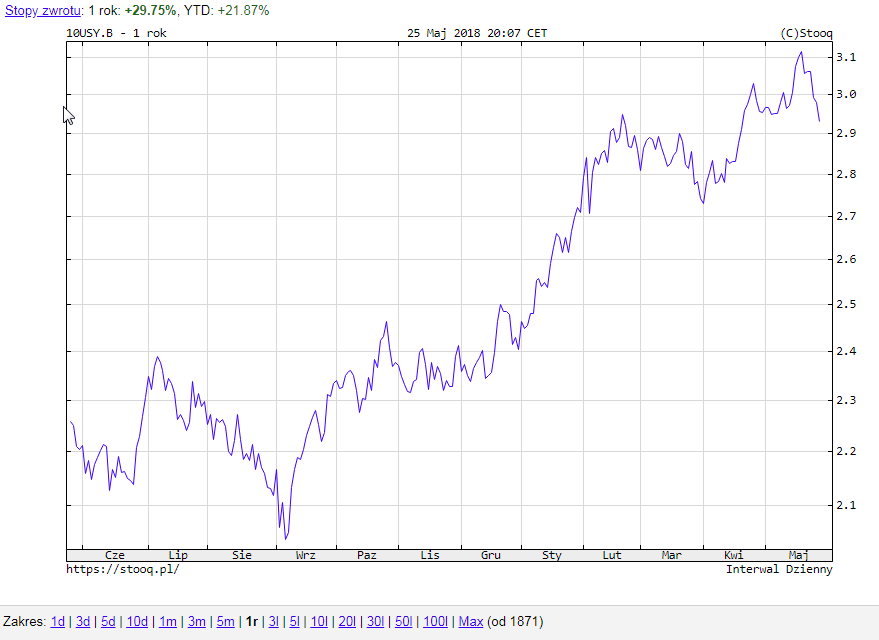
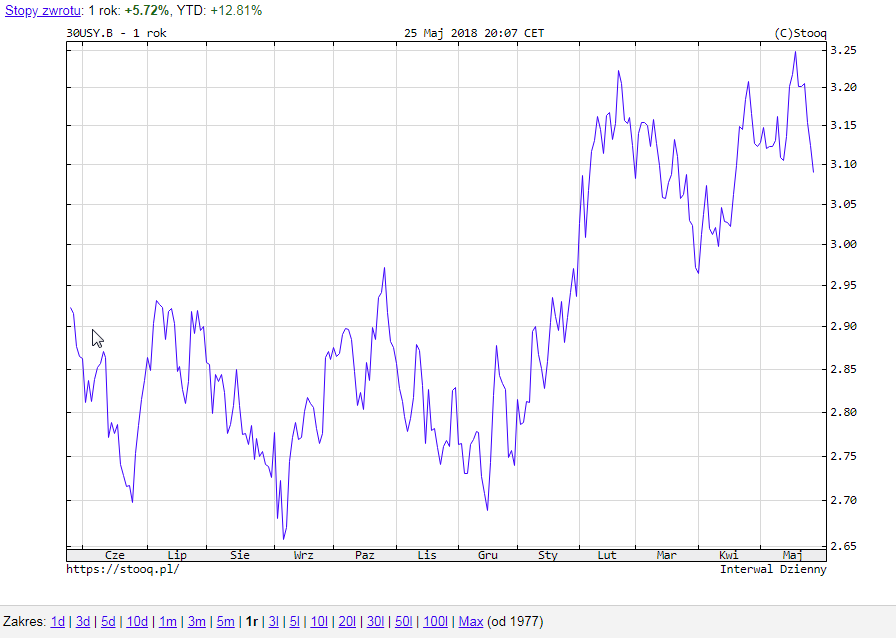
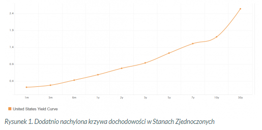

### watch
- [treading economics](https://tradingeconomics.com/)
- [zerohedge](https://www.zerohedge.com/)
- [inwestycje.pl](http://inwestycje.pl/)
- [Obserwator finansowy](https://www.obserwatorfinansowy.pl/tematyka/makroekonomia/)
- [viewswire](http://viewswire.eiu.com/)
- [Blumberg](https://www.bloomberg.com/europe)
- [oilprice](https://oilprice.com/Finance/the-Economy)
- [The Economic Times](https://economictimes.indiatimes.com)
- [CNBC](https://www.cnbc.com/world/)
- 
- 
- 
- 

### lista blogów do przekopania
- [Blogs PL](http://generatorfinansowy.blogspot.com/)

### wykresy
- [investing.com](https://pl.investing.com/indices/wig-20-chart)

#### Portale ogólne
- [macronext.pl](http://www.macronext.pl/pl/)
- [ATtreader](http://www.attrader.pl/abonament/informacje)
- [wnp.pl](https://www.wnp.pl/)
- [prostszezycie.pl](https://prostszezycie.pl/finanse-i-prawo-21)
- [businessinsider.com.pl](https://businessinsider.com.pl/?utm_source=businessinsider.com&utm_medium=referral&utm_campaign=redirect_businessinsider_com)
- [www.bloomberg.com/europe](https://www.bloomberg.com/europe)
- [www.skarbiec.biz](https://www.skarbiec.biz/)
- [infosfera](http://infostrefa.com/infostrefa/pl/index/)
- [HSBC](https://www.hsbc.com/)
- [stockwatch](https://www.stockwatch.pl/)
- [www.topstock.pl](https://www.topstock.pl/stock/company/analysis/KGH)
- [pl.investing.com](https://pl.investing.com/indices/wig-basic-materials)

#### Banki
- [EBC](https://www.ecb.europa.eu/home/html/index.en.html)

#### Youtube
- playlists
  - [Stock Investing](https://www.youtube.com/playlist?list=PLECECA66C0CE68B1E)
  - [Time Value of Money](https://www.youtube.com/watch?v=gkoEAPAW7eg&list=PL_KGEFWqEaTBbYDupRektHIMG0G9u-Ru-)
- videos
  - 

#### Blogi
- [economic collaps](http://theeconomiccollapseblog.com/)
- [pamiętnik giełdowy](http://at-trader.blogspot.com/)
- [Dr. Ed's Blog](http://blog.yardeni.com/)
- [zerohedge](https://www.zerohedge.com/)
- [contra corner](http://davidstockmanscontracorner.com/)
- [SRsrocco report](https://srsroccoreport.com/)
- [Jim Sinclair's](https://www.jsmineset.com/)
- [Doxa](https://slomski.us/)
- [My personal forward guidance](http://franzlischka.blogspot.com/?view=sidebar)
- [Contra corner](http://davidstockmanscontracorner.com/)
- [zbiór blogów bossa.pl](https://blogi.bossa.pl/)

### tools and data 
- [finviz](https://finviz.com/)
- [biznesradar indeksy PL](https://www.biznesradar.pl/gielda/indeksy)
- [Nice chart online](https://pl.tradingview.com/chart/?symbol=FX:EURUSD)
- [Wykresy giełdowe](https://stockcharts.com/) - trail, można założyć konto i potestować

#### inne
- [Kiedy jaka giełda działa](https://market24hclock.com/)
- [podstawy inwestowania](https://appfunds.blogspot.com/2013/11/elementarz-inwestora.html)
- [XPLAIND - yield to maturity](https://xplaind.com/157707/yield-to-maturity)

### Obligacje - cena vs rentowność
Jeśli bank centralny obniża stopy procentowe to obligacje wyemitowane po tej obniżce są niżej oprocentowane. Te obligacje, które były już na rynku mają bardziej atrakcyjne
oprocentowanie i są chętniej kupowane przez inwestorów - ich cena rośnie. 

#### PRZYKŁAD:
*Mamy starsze obligacje za 100, które płaca 3\%. Następnie bank centralny obniża stopy i nowe obligacje płaca 2,5\%. Zatem starsze obligacje są w tym momencie atrakcyjne,
 popyt na nie sprawia ze ich cena rośnie i dociera w okolice 120. Dlaczego 120? Dlatego, że 3 zł wypłacane przez te obligacje podzielone przez 120 zł daje nam rentowność ok. 2,5%.
 I tak to rentowności obligacji wyrównują się dzięki naturalnemu mechanizmowi rynkowemu.*

Jeśli bank centralny podniesie stopy procenowe to stare obligacje muszą potanieć, tak aby to co straciliśmy na mniejszym oprocentowaniu zyskać na cenie. 

- __Stopa referencyjna__ - Stopa referencyjna (interwencyjna, repo) - główna stopa procentowa NBP, określa minimalną rentowność 7-dniowych bonów pieniężnych NBP.
Stopa referencyjna wyznacza minimalną rentowność operacji otwartego rynku.
- __spread__ - na rynku obligacji jest to różnica między rentownoscią obligacji 10-letnich i np 3-miesięcznych (lub 10-letnich i 2-letnich)

__wstawka__ - Oprocentowanie 2-letnich, 10-letnich i 30-letnich obligacji USA na dzień 27.05.18 (stooq.pl)

  
  
  

### Krzywa rentowności obligacji (ang. yield curve, czasowa struktura stóp procentowych)
Jak jest zbudowana krzywa dochodowości?
Żeby zrozumieć, kto wpływa na na kształt krzywej dochodowości musimy zrozumieć jak jest ona zbudowana. Krótki koniec krzywej dochodowości reprezentują papiery dłużne o terminie zapadalności od miesiąca do 2 lat,
na środkowy odcinek przypadają obligacje trzy-, pięcio- i siedmioletnie, a długi koniec – dziesięcio- i trzydziestoletnie.

W normalnych warunkach rozwoju gospodarczego obligacje długoterminowe mają wyższą rentowność, ponieważ obarczone są wyższym ryzykiem inwestycyjnym. W końcu zamrażamy gotówkę na 30 lat,
a nie na rok czy dwa lata. W długim okresie czasu znacznie trudniej przewidzieć zmiany cen i stóp procentowych, dlatego obligacje długoterminowe niejako dyskontują ten problem nieco wyższą rentownością.
Z normalną krzywą dochodowości mamy do czynienia przez większość czasu, kiedy gospodarka rozwija się bez przeszkód. Z odwróconą krzywą dochodowości mamy do czynienia wtedy gdy inwestorzy nie są przekonani, co do stabilności rynku.
Obecnie dzieje się tak ponieważ rynek zakłada, że stopy będą konsekwentnie podwyższane. Pozbywa się więc silniej obligacji krótkoterminowych, ponieważ kolejne emisje dostarczą w najbliższym czasie wyższe
odsetki. Innymi słowy jest to wynik przekonania inwestorów o rozwijającej się inflacji i oczekiwanie na kolejne podwyżki stóp.

Dane dla USA - rentowność wszystkich obligacji na stronie U.S. DEPARTMENT OF THE TREASURY [link](https://www.treasury.gov/resource-center/data-chart-center/interest-rates/Pages/TextView.aspx?data=yieldYear&year=2018)

linki
- [Krzywa dochodowosci - independent trader](https://independenttrader.pl/jak-przewidziec-recesje-gospodarcza-krzywa-dochodowosci.html)
- [Krzywa dochodowości – czyli jak prognozować recesje gospodarczą za pomocą rządowego długu](https://analizy.investio.pl/krzywa-dochodowosci-czyli-jak-prognozowac-recesje-gospodarcza-za-pomoca-rzadowego-dlugu/)

### Materiały do analizy
- [Independent treader - wojna handlowa USA](https://independenttrader.pl/powell-z-trumpem-doprowadza-do-krachu.html) - ciekawe wykresy i dane